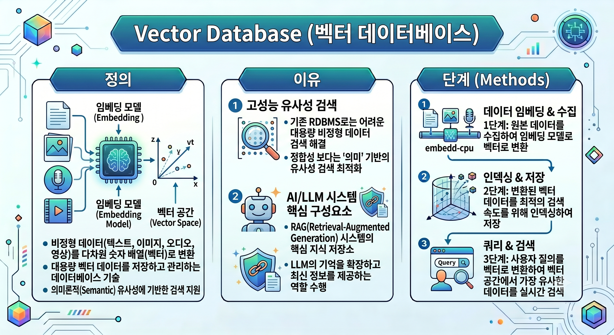
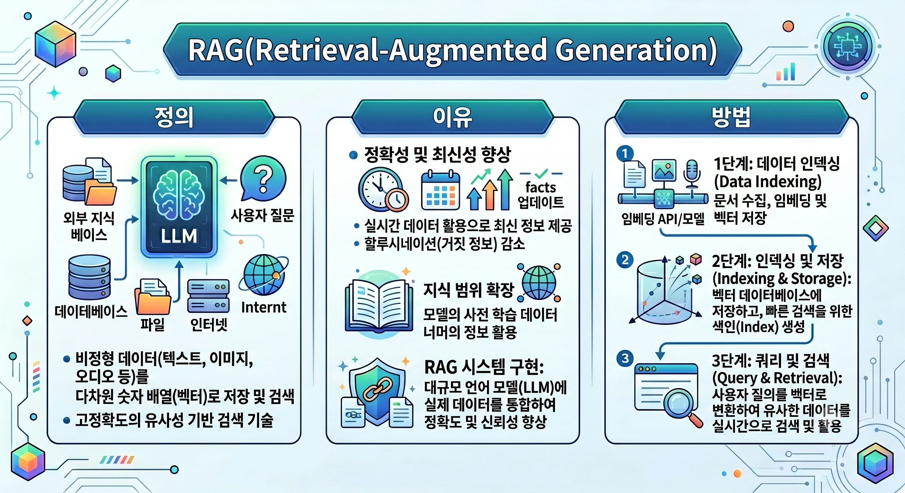

# 1교시
- 운동해라
- 교재 띄워놓고 공부해라
- 
- 

- RAG review
  - rag을 쓰는 이유는 보완을 위해 사용하는것

- 하이브리드 검색
  - dense 기반 검색과 sparse 기반 검색을 동시에 해보는것이 어떻겠냐 (like 앙상블)
- query expansion
  - 원본 질문을 재구성하거나 관련 용어를 추가하여 검색 범위를 넓히는 기법
- ranking
  - 쿼리에 뭐가 더 어울리겠나 순위화 하는것
  - bi-encoder : 질문과 문서를 각각 독립적으로 벡터화 하여 유사도 비교
    - 문서를 이미 흝은 뒤에 질문이 들어오기에 유사도가 그리 높ㅈ지 않을 수 있음
  - cross-encoder : 질문과 문서를 하나의 입력으로 넣음
- hyde
  - llm으로 가상 답변을 생성하고 그 답변을 임베딩 하여 실제 문서를 검색하는 기법
- 개인 플젝
  - from scratch 모델로 진행할것